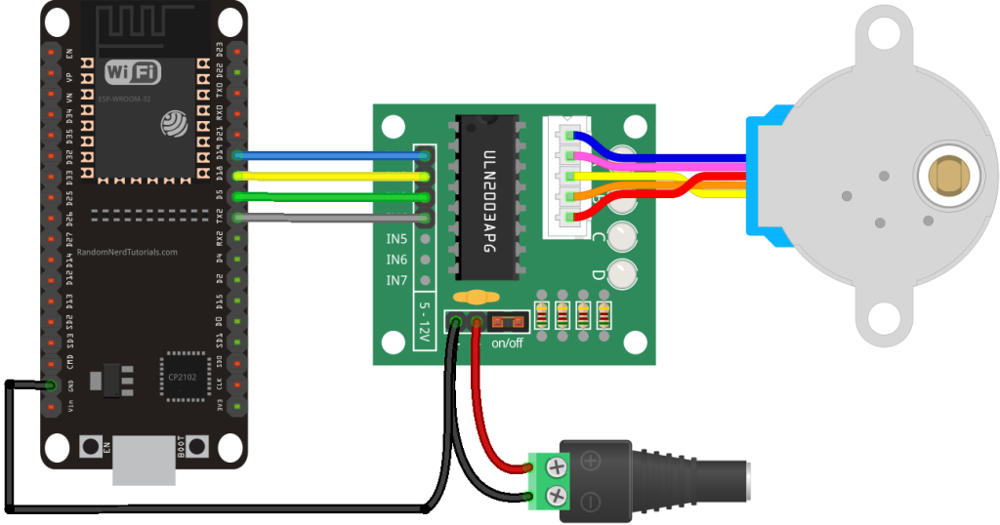
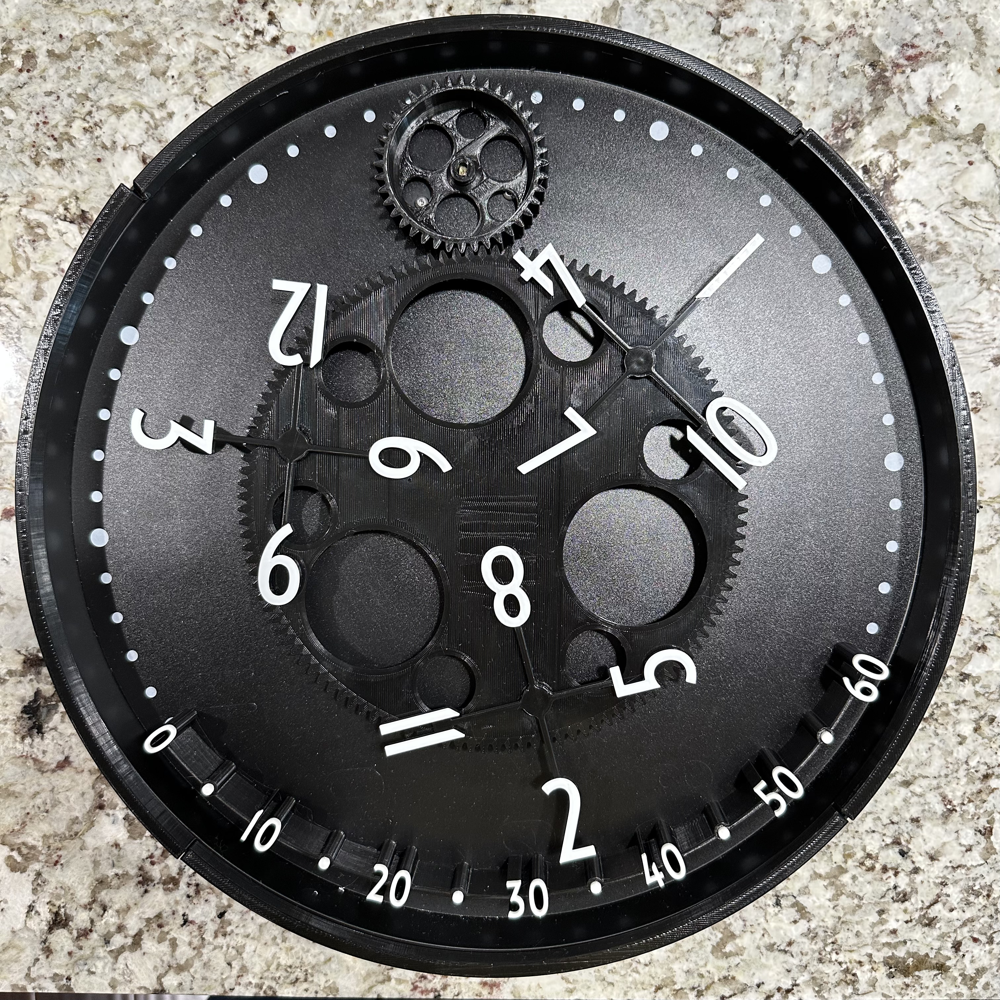
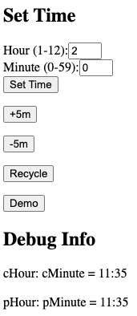

# Wandering Hour Clock

An improved version of 3D printed [wandering hour clock](https://www.printables.com/model/327198-improved-wandering-hour-clock).

## Instructions

### Hardware
- Ikea Bondis clock
- 3D printed parts and additional hardware listed from [Printables](https://www.printables.com/model/327198-improved-wandering-hour-clock), except ClockMovementGear and Standoffs
- 3D printed ClockMovementGear from [Printables](https://www.printables.com/model/429804-wandering-hour-clock-with-stepper-motor)
- Standoffs from [Printables](https://www.printables.com/model/476980-wandering-hour-clock-w-arduino-wifi-stepper-motor-)
- Any ESP board with wifi. e.g. ESP32, ESP8266
- 28BYJ-48 unipolar stepper motor
- ULN2003 motor driver
- 5V power supply (preferrably with 2A+)
- Jumper wires

### Wiring Diagram
- Wiring instructions for [ESP32](https://randomnerdtutorials.com/esp32-stepper-motor-28byj-48-uln2003/), [ESP8266](https://randomnerdtutorials.com/esp8266-nodemcu-stepper-motor-28byj-48-uln2003/)

(Image Credit: https://randomnerdtutorials.com)

### Arduino Sketch
- The arduino code in this project adds the following additional features
  - Uses ESP32 with wifi for time from NTP
  - Provides a [web server](#web-server) for easier maintenance and troubleshooting

## Demo

(Image Credit: https://www.printables.com/model/327198-improved-wandering-hour-clock)
### Clock

### Web Server

